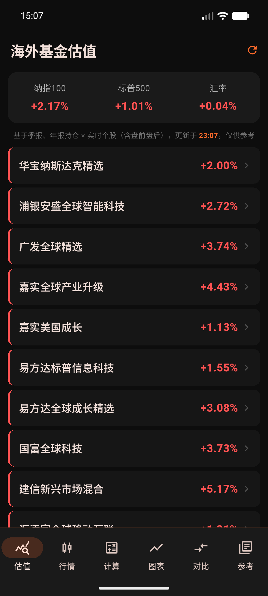
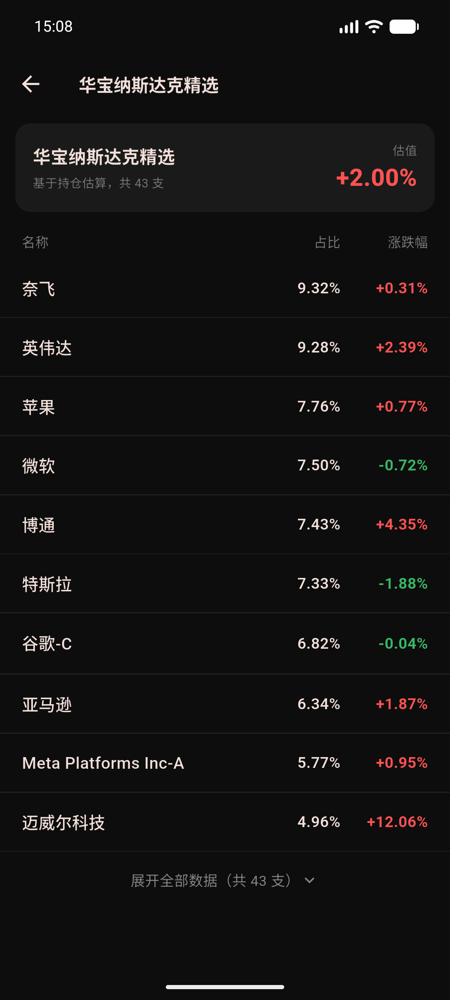
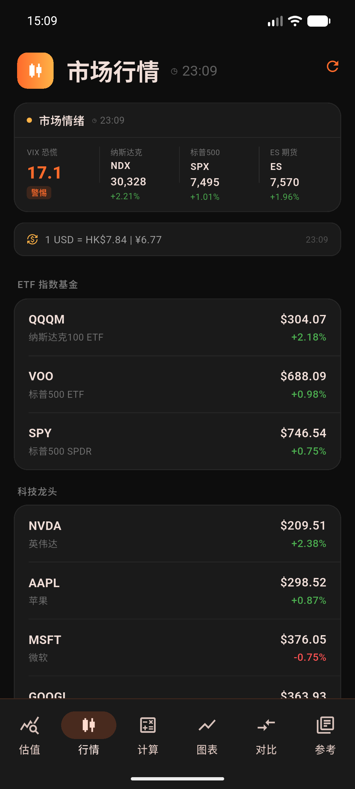
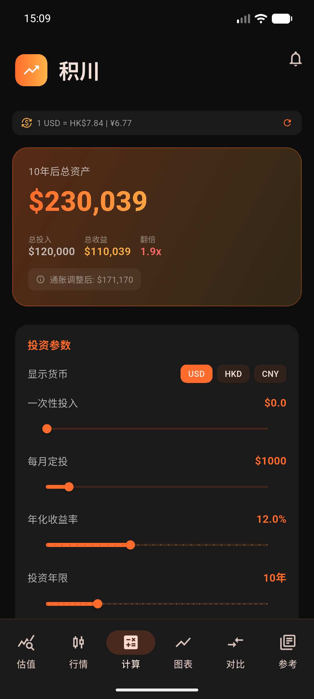
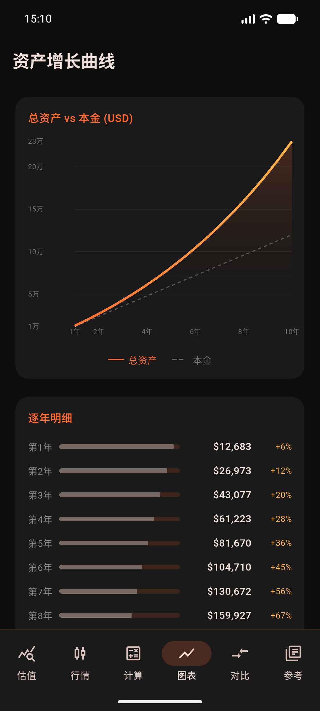
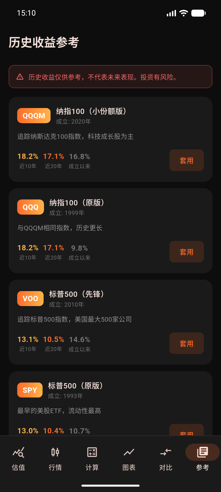

# PulseVest · 积川

<p align="center">
  
</p>

<p align="center">
  Real-time QDII overseas-fund valuation + a long-term DCA toolkit for US equities.<br/>
  <sub>海外基金实时估值 + 美股长期定投工具 — 数据全程大陆可访问，含盘前盘后</sub>
</p>

<p align="center">
  
  
  
  
</p>

---

## Screenshots / 界面预览

<table>
  <tr>
    <td align="center"><b>海外基金估值</b><br/><sub>Fund valuation</sub></td>
    <td align="center"><b>持仓明细</b><br/><sub>Holdings detail</sub></td>
    <td align="center"><b>市场行情</b><br/><sub>Market & watchlist</sub></td>
  </tr>
  <tr>
    <td></td>
    <td></td>
    <td></td>
  </tr>
  <tr>
    <td align="center"><b>DCA 计算器</b><br/><sub>Calculator</sub></td>
    <td align="center"><b>资产增长曲线</b><br/><sub>Growth chart</sub></td>
    <td align="center"><b>历史收益参考</b><br/><sub>Reference returns</sub></td>
  </tr>
  <tr>
    <td></td>
    <td></td>
    <td></td>
  </tr>
</table>

---

## ✨ Highlight · QDII 海外基金实时估值

The flagship feature computes each Chinese QDII fund's intraday NAV estimate the
way professional mini-programs do — **disclosed holdings × each stock's live
change × weight + FX** — and it works from **mainland China, including pre/post
market**.

旗舰功能：用 **持仓 × 个股实时涨跌 × 权重 + 汇率** 估算每只 QDII 基金的当日净值，
大陆可访问，**含盘前盘后**。

```
                     ┌──────────────── 估值引擎 ────────────────┐
 持仓 (Eastmoney F10) │  Q1季报前十大权重 ⊕ 年报补全 (缓存一周)    │
   美股 / 港股 / A股   │            ×                            │
 个股实时涨跌 (Yahoo  │  含盘前盘后、跨市场时段的真实涨跌幅        │  →  基金估值 %
   代理, 腾讯兜底)     │            ×  权重  ÷ Σ权重 (归一化)      │     (红涨绿跌)
 汇率 (新浪央行中间价) │            +  汇率调整                    │
                     └─────────────────────────────────────────┘
```

- **持仓**：东方财富 F10，最新季报前十大权重 + 年报补全完整持仓，本地缓存（季度才变）
- **个股实时涨跌（含盘前盘后）**：Yahoo 行情经一个自部署代理转发（中国免费行情源盘前盘后会冻结在昨收）；腾讯为美股盘中兜底
- **多市场**：美股 (105/106/107) + 港股 (116 → `.HK`) + 沪深 A 股 (1 → `.SS`, 0 → `.SZ`)，每只股票按其所在市场的时段计算
- **汇率**：新浪在岸央行中间价（QDII 净值实际采用）
- 点开任一基金 → 持仓明细（名称 / 占比 / 涨跌幅），默认前十大、可展开全部

> ⚠️ 估值仅供参考。盘前盘后需自部署代理（见 [Getting Started](#getting-started--快速开始)）。

---

## Features / 功能

| Feature | Description |
|---------|-------------|
| **QDII Fund Valuation** | Live intraday NAV estimate per fund, holdings drill-down, US/HK/A-share, incl. pre/post market |
| **Market Home** | Sentiment bar (VIX + NDX/SPX + S&P futures) + live US watchlist (QQQM/VOO/SPY/科技龙头) |
| **DCA Calculator** | Monthly / quarterly / annual compound interest, lump-sum + DCA hybrid |
| **Goal Back-Calculation** | Years to reach target, or monthly contribution needed |
| **Growth Chart** | Interactive asset curve + yearly breakdown table |
| **Multi-Plan Compare** | Save & compare multiple scenarios (persisted locally) |
| **Reference Returns** | Built-in annualized returns: QQQM / QQQ / VOO / SPY / VTI |
| **Live Exchange Rates** | USD → HKD / CNY |
| **DCA Reminders** | Monthly local notifications |
| **Inflation Adjustment** | Real-return display toggle |

---

## Design / 设计

Dark, minimal, orange-accented — built for focus, not decoration. The fund
screen follows the Chinese market convention: **red = up, green = down**.

| Token | Value |
|-------|-------|
| Background | `#0D0D0D` |
| Card | `#1A1A1A` |
| Primary (orange) | `#FF6B2B` |
| Accent (gold) | `#FFB347` |
| Up / Down (fund) | `#FF5252` / `#38B764` |

---

## Tech Stack / 技术栈

| Package | Role |
|---------|------|
| [Flutter 3.x](https://flutter.dev) + Dart | Cross-platform UI |
| [provider](https://pub.dev/packages/provider) | State management |
| [fl_chart](https://pub.dev/packages/fl_chart) | Asset growth chart |
| [shared_preferences](https://pub.dev/packages/shared_preferences) | Local persistence & caching |
| [http](https://pub.dev/packages/http) | Market / fund / FX calls |
| [flutter_local_notifications](https://pub.dev/packages/flutter_local_notifications) | Reminders |
| google_fonts / intl / timezone | Typography & scheduling |
| Cloudflare Worker (JS) | Yahoo quote proxy for pre/post market |

---

## Getting Started / 快速开始

**Prerequisites:** Flutter SDK 3.x — [flutter.dev/get-started](https://docs.flutter.dev/get-started)

```bash
git clone https://github.com/MournfulOx/PulseVest.git
cd PulseVest
flutter pub get
flutter run
```

### Deploy the quote proxy (for pre/post market) / 部署行情代理

Mainland-China-accessible free quote APIs freeze at the regular close during
pre/post market, so PulseVest reads extended-hours prices through a tiny proxy
you host yourself. See [`proxy/README.md`](proxy/README.md) — deploy
[`proxy/yahoo-quote-proxy.js`](proxy/yahoo-quote-proxy.js) on Cloudflare Workers
(or any host that can reach Yahoo and is reachable from China), then set:

```dart
// lib/services/fund_data_service.dart
static const String proxyBase = 'https://<your-worker>.workers.dev';
```

Without it the fund screen still works during US regular hours (Tencent
fallback); pre/post just shows the last close.

### Build / 打包

```bash
flutter build apk --release          # Android → build/app/outputs/flutter-apk/
flutter build ipa                    # iOS (needs Mac + Xcode + Apple Developer)
```

---

## Project Structure / 项目结构

```
lib/
├── main.dart
├── models/         # DCA models + built-in ETF reference data
├── providers/      # calculator · currency · market · fund   (business logic)
├── screens/        # fund_valuation · fund_detail · market · calculator
│                   # · chart · compare · reference
├── widgets/        # input_slider · result_card · market_sentiment_card · …
└── services/       # fund_data_service · market_data_service · notification_service
proxy/
└── yahoo-quote-proxy.js   # Cloudflare Worker — Yahoo quotes incl. pre/post
```

---

## Data Sources / 外部数据源

All free, no API key. Designed to stay accessible from mainland China.

| Data | Source |
|------|--------|
| Fund holdings (持仓) | Eastmoney F10 `fundf10.eastmoney.com` |
| US stock quotes incl. pre/post | Yahoo Finance, via the self-hosted proxy |
| US stock quotes (regular, fallback) | Tencent `qt.gtimg.cn` |
| Indices / VIX | Tencent + Sina + Eastmoney (multi-source race) |
| USD/CNY (在岸中间价) | Sina `hq.sinajs.cn` |
| Exchange rates (USD/HKD/CNY) | frankfurter.app |

API failures degrade gracefully — cached values or "Unavailable", never a crash.

---

## Roadmap / 计划中

- [x] QDII fund live valuation (holdings × live price × weight + FX)
- [x] Pre/post market via self-hosted proxy
- [x] US + HK + A-share holdings
- [x] Market sentiment bar + US watchlist
- [x] DCA calculator · goal back-calc · growth chart · multi-plan compare
- [ ] P/E percentile + Shiller CAPE (reference screen)
- [ ] Background (app-closed) price alerts
- [ ] iOS App Store release

---

## License

MIT © 2025 MournfulOx
