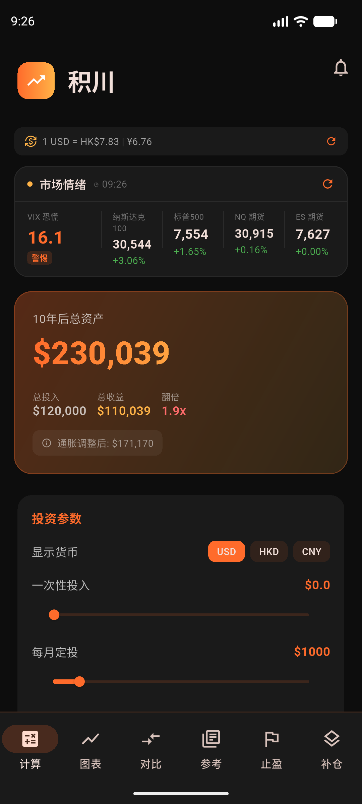
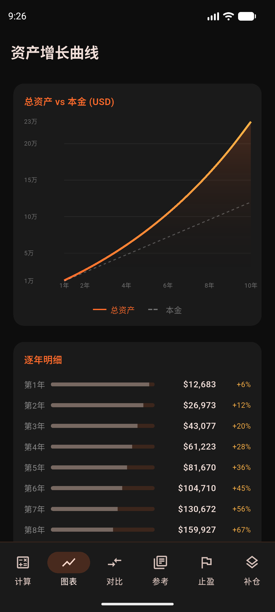
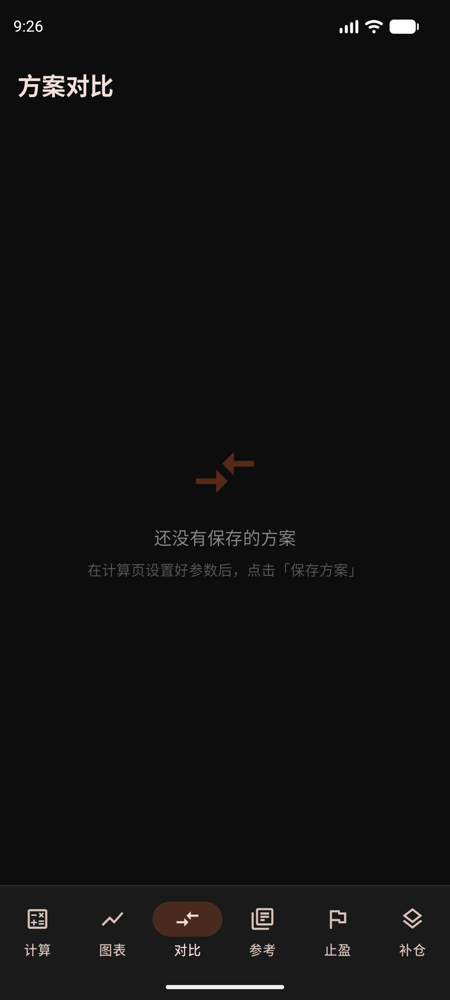
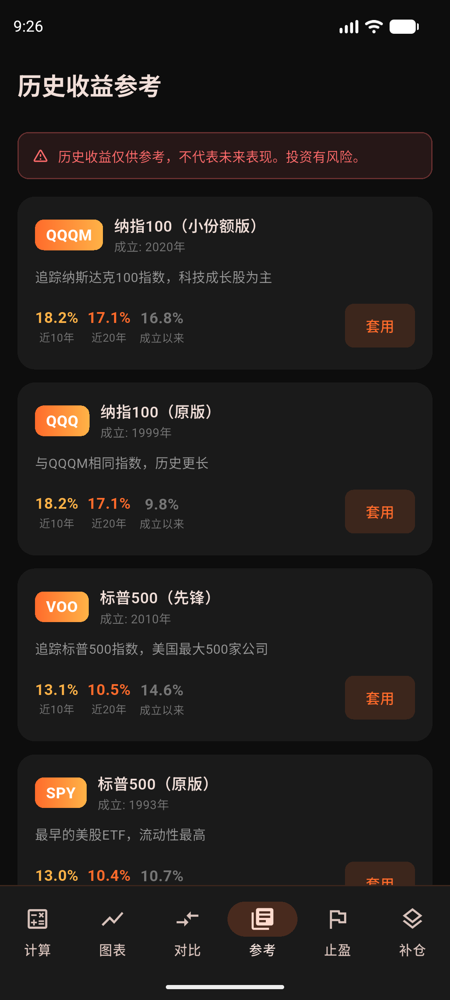
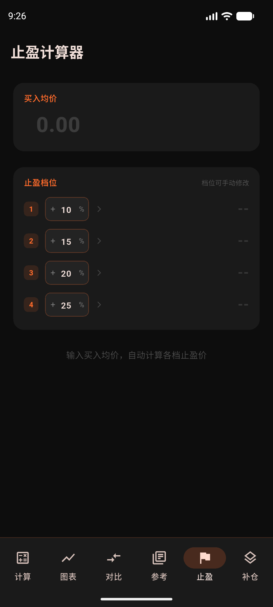
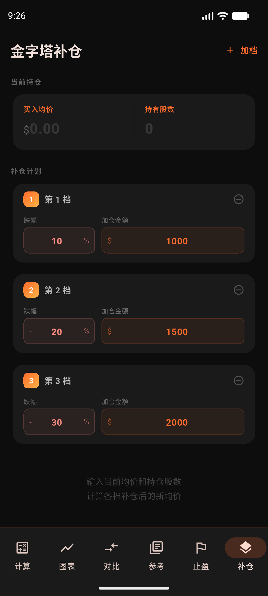

# PulseVest · 积川

<p align="center">
  
</p>

<p align="center">
  A minimalist long-term DCA investment calculator for US equities.<br/>
  <sub>极简美股定投计算器，专为 Nasdaq 100 / S&P 500 长期投资者设计</sub>
</p>

<p align="center">
  
  
  
  
</p>

---

## Screenshots / 界面预览

<table>
  <tr>
    <td align="center"><b>DCA 计算器</b></td>
    <td align="center"><b>资产增长曲线</b></td>
    <td align="center"><b>方案对比</b></td>
  </tr>
  <tr>
    <td></td>
    <td></td>
    <td></td>
  </tr>
  <tr>
    <td align="center"><b>历史收益参考</b></td>
    <td align="center"><b>止盈计算器</b></td>
    <td align="center"><b>金字塔补仓</b></td>
  </tr>
  <tr>
    <td></td>
    <td></td>
    <td></td>
  </tr>
</table>

---

## Features / 功能

| Feature | Description |
|---------|-------------|
| **DCA Calculator** | Monthly / quarterly / annual compound interest, lump-sum + DCA hybrid |
| **Goal Back-Calculation** | Years to reach target, or monthly contribution needed |
| **Growth Chart** | Interactive asset curve + yearly breakdown table |
| **Multi-Plan Compare** | Save and compare multiple scenarios (persisted locally) |
| **Market Sentiment Bar** | Live VIX + NDX/SPX index + NQ/ES futures |
| **Live Exchange Rates** | USD → HKD / CNY via frankfurter.app |
| **ETF Reference Data** | Built-in annualized returns: QQQM / QQQ / VOO / SPY / VTI |
| **Take-Profit Calculator** | Average cost → target prices at +10% / +15% / +20% / +25% |
| **Pyramid Averaging Down** | Multi-level cost averaging calculator with new average cost per level |
| **DCA Reminders** | Monthly push notifications to stay on schedule |
| **Inflation Adjustment** | Real-return display toggle |

---

## Design / 设计

Dark, minimal, orange-accented — built for focus, not decoration.

| Token | Value |
|-------|-------|
| Background | `#0D0D0D` |
| Card | `#1A1A1A` |
| Primary (orange) | `#FF6B2B` |
| Accent (gold) | `#FFB347` |
| Text | `#FFFFFF` |

Orange is reserved for key data and interactive elements only.

---

## Tech Stack / 技术栈

| Package | Role |
|---------|------|
| [Flutter 3.x](https://flutter.dev) + Dart | Cross-platform UI |
| [fl_chart](https://pub.dev/packages/fl_chart) | Asset growth chart |
| [provider](https://pub.dev/packages/provider) | State management |
| [shared_preferences](https://pub.dev/packages/shared_preferences) | Local plan persistence |
| [http](https://pub.dev/packages/http) | Market & FX API calls |
| [flutter_local_notifications](https://pub.dev/packages/flutter_local_notifications) | DCA reminders |
| [google_fonts](https://pub.dev/packages/google_fonts) | Typography |
| intl / timezone | Formatting & scheduling |

---

## Getting Started / 快速开始

**Prerequisites:** Flutter SDK 3.x — [flutter.dev/get-started](https://docs.flutter.dev/get-started)

```bash
git clone https://github.com/MournfulOx/PulseVest.git
cd PulseVest
flutter pub get
flutter run
```

### Build Release APK / 打包 Android

```bash
flutter build apk --release
# → build/app/outputs/flutter-apk/app-release.apk
```

### Build iOS / 打包 iOS

Requires Mac + Xcode 15+ + Apple Developer account.

```bash
flutter build ipa
```

---

## Project Structure / 项目结构

```
lib/
├── main.dart
├── models/         # Data models + built-in ETF reference data
├── providers/      # calculator · currency · market  (business logic)
├── screens/        # calculator · chart · compare · reference · takeprofit · pyramid
├── widgets/        # input_slider · result_card · market_sentiment_card · …
└── services/       # notification_service
```

---

## External APIs / 外部数据源

All APIs are free and require no key.

| Data | Source |
|------|--------|
| Exchange rates (USD/HKD/CNY) | [frankfurter.app](https://www.frankfurter.app) |
| VIX / NDX / SPX / NQ / ES | Yahoo Finance public endpoint |

API failures degrade gracefully — cached values or "Unavailable", never a crash.

---

## Roadmap / 计划中

- [x] DCA + lump-sum hybrid calculator
- [x] Goal back-calculation
- [x] Multi-plan save & compare
- [x] Live market sentiment bar (VIX + futures)
- [x] Take-profit calculator
- [x] Pyramid averaging-down calculator
- [ ] P/E historical percentile + Shiller CAPE
- [ ] US CPI YoY (FRED API)
- [ ] 10-year Treasury yield
- [ ] Position size manager
- [ ] iOS App Store release

---

## License

MIT © 2025 MournfulOx
